# 3xN1 Collatz Research System

This repository is evolving from a single Collatz plotter into a C++20/CUDA
research system for generating validated Collatz path features and looking for
learnable path patterns.

For a positive whole number `n`:

```text
if n is even: n = n / 2
if n is odd:  n = 3n + 1
repeat until n = 1
```

The new performance path is C++20 with fixed-width integer fast paths. Python is
not used for classical Collatz scanning, dataset generation, progress serving,
or validation.

## Current Evidence Snapshot

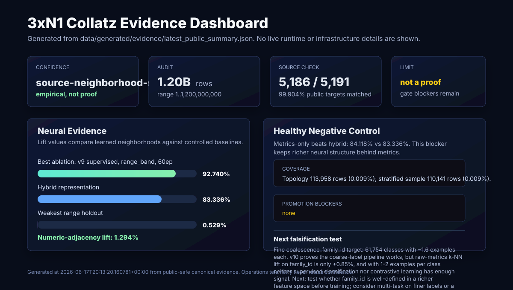

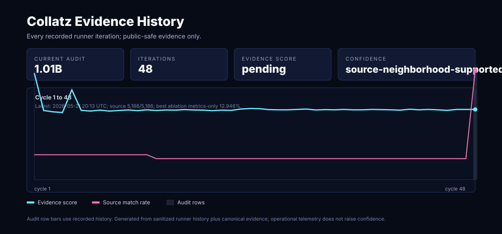

### Original (metrics-only) vs ours (hybrid)

All numbers use one consistent metric: k=2 nearest-neighbor same-label purity
minus the random baseline, over 100,000 Collatz trajectories. The **non-AI
baseline** is the raw trajectory metrics (`m0`-`m31`) with no learning.
**Original** = metrics-only features; **ours** = hybrid (all branches:
metrics+shape+parity+residue). Both trained models use the v10 multi-task
supervised method. Authoritative source:
`data/generated/evidence/model_comparison.json`.

> **Metric correction:** an earlier off-by-one in the kNN code used `topk(3)`
> after excluding self and was mislabeled `k=2`; it is fixed (now `topk(2)`) and
> every number below is recomputed. Before/after: `data/generated/evidence/knn_recompute.json`.

| Label | Classes | Non-AI baseline (raw) | Original (metrics-only) | Ours (hybrid) |
|---|---:|---:|---:|---:|
| range_band | 16 | +13.9% | +88.6% | +89.8% |
| bit_length | 17 | +31.3% | +72.2% | +72.8% |
| peak_ratio_bucket | 28 | +57.1% | +85.4% | +84.2% |
| **summed lift** | - | - | +2.462 | +2.468 |

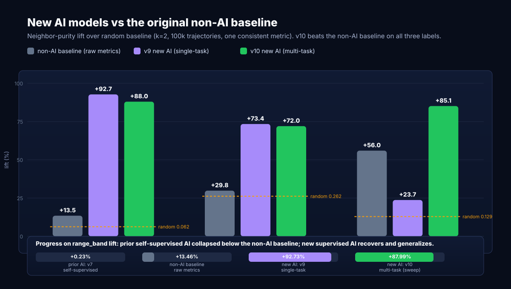

**Both trained models beat the non-AI baseline on every label.** But **ours
(hybrid) is tied with original (metrics-only)** -- hybrid is +1.2 pts on
range_band, +0.6 on bit_length, and -1.2 on peak_ratio_bucket (summed delta
+0.006). The win came from the supervised METHOD over the prior
self-supervised contrastive line (v4-v7), which collapsed to +0.23% on
`range_band` -- below the zero-learning non-AI baseline (+13.5%) -- not from
the hybrid FEATURES over metrics-only. Full postmortem:
[docs/NEURAL_ENGINE_V9.md](docs/NEURAL_ENGINE_V9.md).


> **Metric note (do not mix):** the older ablation numbers elsewhere in this
> repo (`metrics-only 84.118%`, `hybrid 83.336%`, etc.) are a *different* metric
> -- family-pair retrieval lift -- and are **not comparable** to the
> neighbor-purity lift in the table above. They are retained only as history
> (see Prior experiments below).

### Fine-structure frontier (v11)

The coarse labels above are saturated; the open target is the fine
`coalescence_family_id`, which is 58% singletons (unlearnable as classes). v11
attacks it two ways, both on metrics-only features (hybrid hurts the fine target):

**Few-shot prototypical learning (the method win).** On the 1,269 families with
>=5 members (7,101 rows), a prototypical-network embedding lifts k=2 retrieval
from the raw-metrics baseline **+12.5%** to **+64.0%** -- 5.1x.

**Re-clustered families (the structural win).** k-means in metrics space into
~2,000 families (~50 members each) covers all 100,000 rows (vs 58% singletons),
is only 22% magnitude (finer structure, not just `range_band`), and recovers
**77% of the original fine family structure** (NMI 0.768 vs NMI(family_id,
range_band) 0.415). So the fine family structure is real and learnable at a
coarser granularity -- the singleton problem was a granularity artifact.

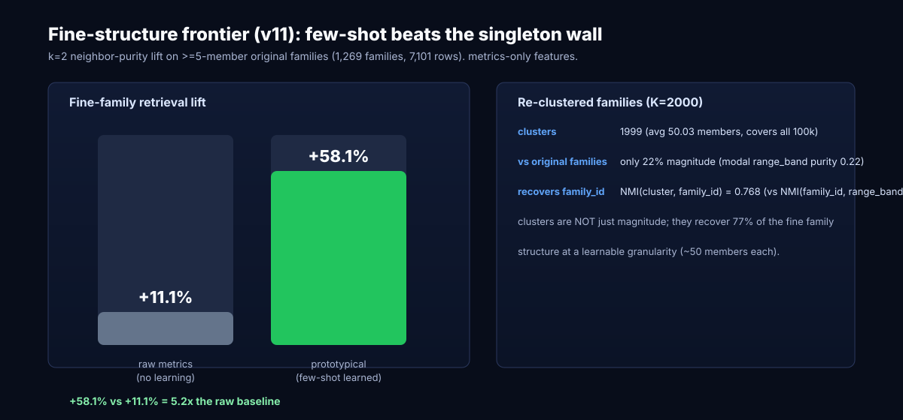

Source: `data/generated/contrastive_v11/metrics.json`. Full write-up:
[docs/NEURAL_ENGINE_V11.md](docs/NEURAL_ENGINE_V11.md).
### Held-out validation (v12) -- not transductive

The v9-v11 k-NN purity was computed over all rows (in-sample/transductive). v12
re-runs the key claims on held-out, disjoint splits (queries and pool come only
from the held-out split):

**Family-disjoint (fine family_id, >=5 members).** Train prototypical on 80%
of families, evaluate retrieval on the held-out 20% of families -- families the
model never saw. 3 seeds:

| metric | value |
|---|---:|
| raw-metrics lift (test pool) | +25.1% |
| held-out prototypical lift (mean) | **+82.3%** |
| std across 3 seeds | +/-1.2% (CI95 +79.9% .. +84.6%) |

The fine-family result generalizes to *unseen* families, not transductive
overfitting, with a tight seed CI.

**Row-disjoint (coarse multi-task).** Train on 80% of rows, evaluate retrieval
on held-out 20% of rows per coarse label:

| Label | raw (test) | held-out (test) |
|---|---:|---:|
| range_band | +12.0% | +84.8% |
| bit_length | +25.1% | +70.9% |
| peak_ratio_bucket | +50.4% | +83.3% |

The coarse embedding generalizes to held-out rows; held-out lifts match the
in-sample v10 numbers, so they are not row-memorization.

Source: `data/generated/contrastive_v12/metrics.json`. Full write-up:
[docs/NEURAL_ENGINE_V12.md](docs/NEURAL_ENGINE_V12.md).
### Re-cluster characterization (v13) -- what the clusters are, and an honest negative

v11 flagged that its re-cluster retrieval number was circular (clusters defined
in metrics space). v13 closes that:

**What the ~2,000 clusters are** (NMI with each known label, k=2):

| Label | NMI(cluster, label) | modal purity |
|---|---:|---:|
| range_band | 0.134 | 0.223 |
| bit_length | 0.155 | 0.495 |
| peak_ratio_bucket | 0.310 | 0.603 |
| coalescence_family_id | **0.768** | 0.030 |

The clusters recover fine family structure (NMI 0.768) and are NOT magnitude
(range_band NMI 0.134, only 22% pure); their strongest single-label alignment is
peak_ratio. So the clusters are fine-family + peak-ratio structure, not magnitude.

**Cluster target is circular.** Cluster-disjoint held-out: raw +88.6%, held-out
+89.4%. Raw is near-ceiling because k-means clusters are Voronoi cells in metrics
space -- so retrieval-by-cluster is circular by construction (this confirms the
reviewer's point about the v11 recluster number).

**Cluster-proxy does not beat raw metrics on the real target.** Train prototypical
on the cluster labels (never seeing `family_id`), then evaluate family-disjoint on
the original fine `family_id` (>=5 members): raw **+24.7%**, cluster-trained
held-out **+21.0%** (std +/-0.9). It does NOT beat raw metrics.

**Net:** re-clustering is a useful *diagnostic* (it proves fine structure exists at
a learnable, non-magnitude granularity), but it is not a training target that
beats raw metrics for fine-family retrieval. The winning fine-family approach
remains *direct* few-shot prototypical supervision on the fine families
themselves (v12: +82.3% held-out), which far exceeds both raw (+24.7%) and the
cluster-proxy (+21.0%).

Source: `data/generated/contrastive_v13/metrics.json`. Full write-up:
[docs/NEURAL_ENGINE_V13.md](docs/NEURAL_ENGINE_V13.md).
### Toward a proof: candidate-invariant search (honest negative)

`research/invariant_search.py` searches closed-form Lyapunov (decrease)
functions for the accelerated Collatz map `S(n)=(3n+1)/2^v2(3n+1)` and
falsifies them on all odd n up to 20,000,000. This is the ML-to-proof handoff
(candidate-invariant discovery), **not** a proof.

- **1-step `S(n)<n`:** holds on 50.0% -- fails for all `n = 3 mod 4` (forced
  increase to ~1.5n). Not an invariant.
- **k-step `S^k(n)<n`:** climbs with k (k=8: 80.6%) but never reaches 100%. No
  fixed-step Lyapunov.
- **residue-weighted log `f(n)=log2(n)+w[n mod 2^L]`:** INFEASIBLE at L=8 and
  L=12 (checked exactly via Bellman-Ford negative-cycle detection). Obstructing
  residue cycle through class 3 -> 5 -- the `n = 3 mod 4` increase cannot be
  compensated by any bounded residue weighting.

So the natural simple invariants are falsified, with the structural obstruction
pinpointed (the `3 mod 4` accelerated increase). This is consistent with Collatz
being open and tells a mathematician exactly where the simple ansatz breaks. A
real proof needs a non-bounded-residue invariant, a density-1-plus-exceptions
argument, or cycle/divergence exclusion -- then formalization in Lean/Coq. Full

`research/invariant_falsifier.py` is the reusable engine: throw any candidate
invariant at it and it reports survival on all odd n up to 2e7 plus the exact
residue-weighted feasibility check. Run against the richer classes the obstruction
pointed at (halving-count and multi-step coupling), every candidate was falsified
-- most already at n=3 -- and the residue-weighted ansatz stays infeasible at L=12.
The durable asset is the falsifier, not any one-shot result.
write-up: [docs/PROOF_WORK.md](docs/PROOF_WORK.md).


The block below is generated from
`data/generated/evidence/latest_public_summary.json`. Do not hand-edit evidence
numbers in the README.

<!-- BEGIN GENERATED EVIDENCE SNAPSHOT -->
- Confidence: `source-neighborhood-supported`
- Meaning: Supervised embedding now beats raw-metrics k-NN across all coarse labels: v10 multi-task reaches +88.6% lift on range_band (raw +13.9%), +72.2% on bit_length (raw +31.3%), and +85.4% on peak_ratio_bucket (raw +57.1%) -- k=2 corrected. This retires the self-supervised contrastive line (v4-v7), which collapsed to +0.23% on range_band. Remaining open question is the fine coalescence_family_id target, where raw-metrics lift is only +12.5% (k=2).
- Audit: `1,200,000,000` rows over `1..1,200,000,000`; full audit completed: `true`.
- Coverage: topology `113,958` rows (`0.009%` of audit); stratified evidence sample `110,141` rows (`0.009%`).
- Neural result: `100,000` sample rows; GPU used: `true`; parallel jobs completed: `0`.
- Learned lift: weakest range `0.529%`, fold minimum `0.417%`, numeric-adjacency lift `1.294%`.
- Best current ablation: `v9 supervised, range_band, 60ep at 92.817%`.
- Interpretation: `supervised embedding recovers structure`; Self-supervised contrastive (v4-v7) collapsed below the raw-feature baseline: v7 got +0.23% lift on range_band while raw-metrics k-NN already gives +13.9% (k=2). Diagnostics proved the m0-m31 metrics carry overwhelming signal (a 40-epoch supervised MLP hits 95.8% range_band accuracy). v9 single-label supervised embedding reaches +92.8% lift; v10 multi-task supervised embedding beats raw-metrics k-NN on range_band (+88.6%), bit_length (+72.2%) and peak_ratio_bucket (+85.4%) -- the first general-purpose embedding. v11 few-shot prototypical lifts the fine family_id (>=5-member families) from +12.5% to +64.0%. Self-supervised contrastive was the wrong tool once labels are available. (k=2 corrected; see knn_recompute.json.).
- Healthy negative control: `metrics-only` beats `hybrid` (`84.118%` vs `83.336%`), so richer neural structure has not yet earned promotion beyond simpler trajectory metrics.
- Promotion blockers: `none`.
- Source alignment: `5,186 / 5,191` matched; unknown unmatched rows `0`.
- Next experiment: Fine coalescence_family_id at full granularity: 61,754 classes, 58% singletons. v11 re-clustering recovers 77% of family structure (NMI 0.768) at a learnable ~50-member granularity and few-shot prototypical reaches +64.0% on >=5-member families. Next: train/eval-split on the re-clustered families as the label (non-circularly) for a single general-purpose fine-structure embedding, and add family-disjoint held-out evaluation. Add SHA-256 pinning of feature files and make safe-metrics the default export mode.
- This is empirical evidence, not a Collatz proof.
<!-- END GENERATED EVIDENCE SNAPSHOT -->

The dashboard is intentionally compact: it should answer what the AI currently
believes, how confident it is, what evidence supports that, what limits the
claim, and what experiment should falsify or strengthen it next.

Longer operating notes live in:

- [Evidence contract](docs/EVIDENCE.md)
- [Source alignment](docs/SOURCE_ALIGNMENT.md)
- [Neural pipeline](docs/NEURAL_PIPELINE.md)
- [Dashboard](docs/DASHBOARD.md)
- [Limitations](docs/LIMITATIONS.md)
- [Runner](docs/RUNNER.md)
- [Reproducibility](docs/REPRODUCIBILITY.md)
- [Build notes](docs/BUILD.md)

## Prior experiments (legacy family-pair metric)

The charts below are from earlier ablations on a *different* metric (family-pair
retrieval lift, not the neighbor-purity lift used above) and the self-supervised
contrastive runs that v9/v10 retired. Kept for history, not for comparison with
the current numbers.

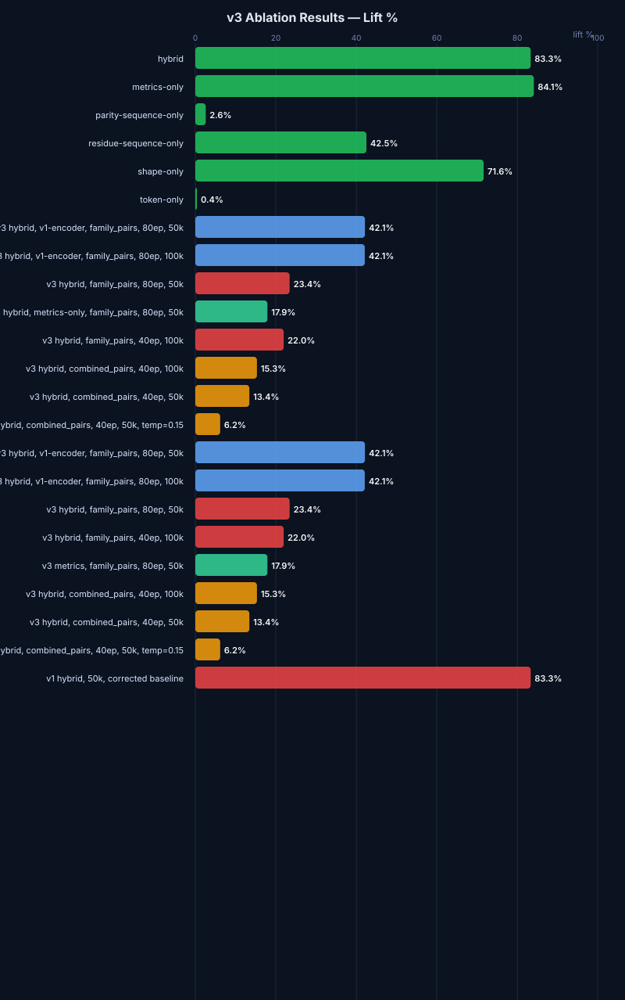

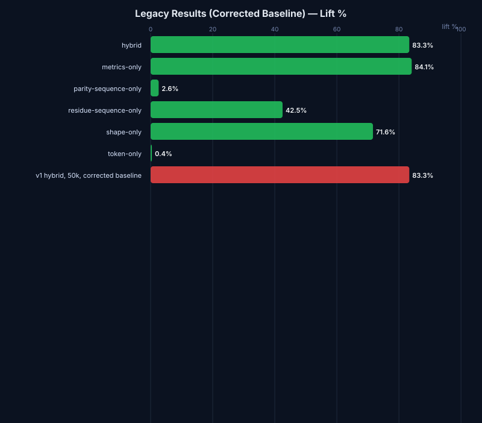

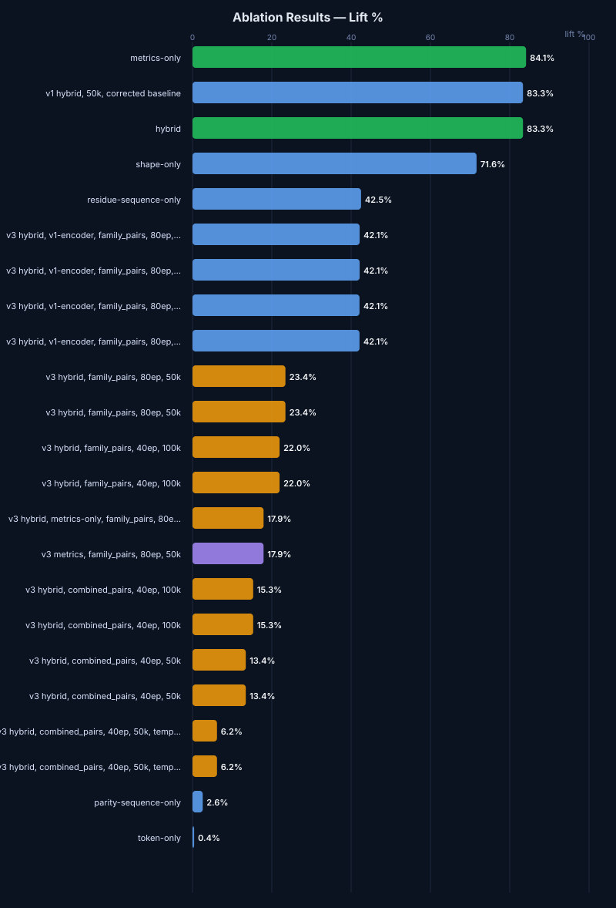

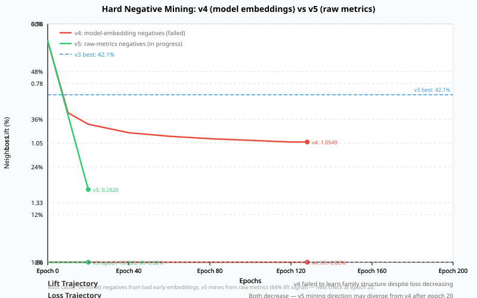

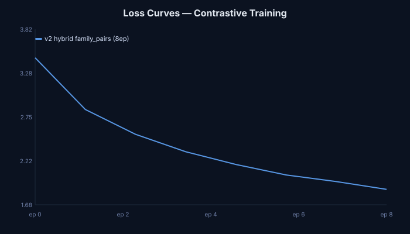

## Visual Research Artifacts

The project keeps the first screen focused on the usable research state:
trajectory plots, path-as-image encodings, topology maps, GNN graph previews,
and source-alignment summaries.

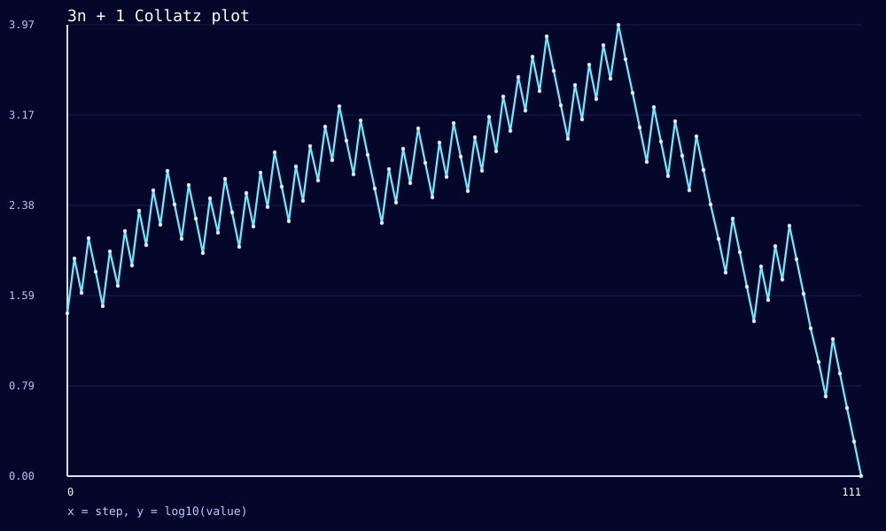

The path-as-image route turns trajectories into visual tensors for clustering,
autoencoders, contrastive learning, and anomaly review.

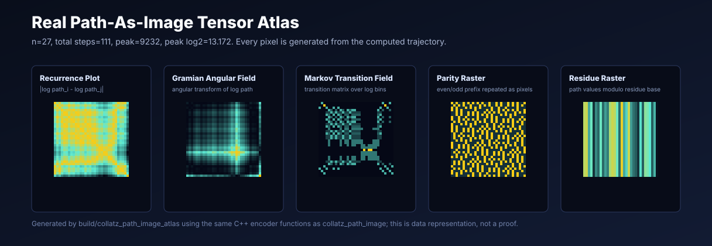

This atlas is not a mockup. It is generated from the actual C++ path-image
encoder for `n=27`; every pixel comes from the computed trajectory and the same
recurrence/GAF/MTF/parity/residue transforms used by `collatz_path_image`.

## Build

```sh
make
```

This builds:

- `build/collatz_plot`
- `build/collatz_scan_cpu`
- `build/collatz_validate_sources`
- `build/collatz_web`
- `build/collatzctl`
- `build/collatz_train`
- `build/collatz_embed_export`
- `build/collatz_path_image`
- `build/collatz_path_image_atlas`
- `build/collatz_select_representatives`
- `build/collatz_stratified_sample`
- `build/collatz_full_audit`
- `build/collatz_graph_export`
- `build/collatz_embedding_analyze`
- `build/collatz_neighborhood_analyze`
- `build/collatz_selftest`
- `build/collatz_insight_analyze`
- `build/collatz_hypothesis_analyze`
- `build/collatz_source_targets`
- `build/collatz_source_align`
- `build/collatz_evidence_publish`

Run validation:

```sh
make test
```

Build an expanded public source-validation target table from OEIS and public
record-holder files:

```sh
mkdir -p data/imported
curl -L -o data/imported/b006577.txt https://oeis.org/A006577/b006577.txt
curl -L -o data/imported/b006884.txt https://oeis.org/A006884/b006884.txt
curl -L -o data/imported/roosendaal_pathrecs.html https://www.ericr.nl/wondrous/pathrecs.html
curl -L -o data/imported/roosendaal_delrecs.html https://www.ericr.nl/wondrous/delrecs.html
curl -L -o data/imported/barina_path_records.html https://pcbarina.fit.vutbr.cz/path-records.htm
curl -L -o data/imported/oliveira_max_excursion.txt.gz https://sweet.ua.pt/tos/3x%2B1/t0.txt.gz
curl -L -o data/imported/oliveira_stopping.txt.gz https://sweet.ua.pt/tos/3x%2B1/t1.txt.gz
gzip -dk data/imported/oliveira_max_excursion.txt.gz
gzip -dk data/imported/oliveira_stopping.txt.gz
./build/collatz_source_targets \
  --oeis-stopping data/imported/b006577.txt \
  --oeis-path-records data/imported/b006884.txt \
  --roosendaal-path-records data/imported/roosendaal_pathrecs.html \
  --roosendaal-delay-records data/imported/roosendaal_delrecs.html \
  --barina-path-records data/imported/barina_path_records.html \
  --oliveira-max-excursion-records data/imported/oliveira_max_excursion.txt \
  --oliveira-stopping-records data/imported/oliveira_stopping.txt \
  --output data/generated/source_validation/public_source_targets.csv \
  --max-n 100000000 \
  --stopping-limit 5000 \
  --path-record-limit 100 \
  --generic-record-limit 250
```

The first four CSV columns remain compatible with the source-alignment tool:
`source,n,total_steps,peak_low`. Extra provenance columns record source kind,
rank, URL, retrieval timestamp, and parser. Starts above the active scan range
are counted as future source targets instead of being used for dashboard
confidence.

## Run

```sh
./build/collatz_plot 7
./build/collatz_plot 27 --width 120 --height 30 --csv data/generated/path_27.csv
./build/collatzctl sample 27
./build/collatzctl inspect-bin data/generated/features_1_100m.bin
```

If a binary file was resumed from a smaller smoke range, repair the header
without rewriting the records:

```sh
./build/collatzctl patch-bin-header data/generated/features_1_100m.bin --range-end 100000000
```

Run a CPU scan:

```sh
./build/collatz_scan_cpu \
  --start 1 \
  --end 1000000 \
  --output data/generated/features.csv \
  --progress logs/progress.jsonl \
  --chunk-size 100000 \
  --threads 8 \
  --resume
```

For large dataset generation, prefer the compact binary format:

```sh
./build/collatz_scan_cpu \
  --start 1 \
  --end 100000000 \
  --output data/generated/features_1_100m.bin \
  --progress logs/progress.jsonl \
  --chunk-size 100000 \
  --threads 16 \
  --format bin \
  --resume
```

The scanner writes a metadata sidecar by default at `OUTPUT.metadata.json`.
Use `--metadata FILE` to choose a specific sidecar path.

Export embedding-ready research inputs from a binary feature file:

```sh
./build/collatz_embed_export \
  --input data/generated/features_1_100m.bin \
  --output-dir data/generated/ml_1_100m \
  --limit 1000000 \
  --sketch-dims 128
```

This writes metric vectors, parity-run tokens, residue-transition streams,
fixed-length log-path sketches, and metadata under the output directory.
Use `--sample-file data/generated/stratified/samples.csv` to export tensors for
an evidence sample that spans the full binary scan instead of only the first
`--limit` records.

Generate deterministic path-image artifacts for a single start value:

```sh
./build/collatz_path_image \
  --n 27 \
  --output-dir data/generated/images_27 \
  --size 64
```

Or render representatives from a binary feature file:

```sh
./build/collatz_path_image \
  --input data/generated/features_1_100m.bin \
  --count 16 \
  --output-dir data/generated/images_sample \
  --size 64
```

The image utility writes recurrence plots, Gramian Angular Fields, Markov
Transition Fields, parity rasters, residue rasters, and a `manifest.json`.

Regenerate the README path-image atlas from the real encoder:

```sh
./build/collatz_path_image_atlas \
  --n 27 \
  --output docs/media/path-image-atlas.svg \
  --size 32
```

The committed atlas is deliberately generated from a specific trajectory rather
than drawn by hand, so it is reproducible and auditable.

Regenerate the README dashboard image from the canonical public evidence JSON:

```sh
python3 tools/render_dashboard_summary.py \
  --input data/generated/evidence/latest_public_summary.json \
  --output docs/media/dashboard-summary.svg
```

Regenerate the historical evidence graph from sanitized runner history:

```sh
python3 tools/render_evidence_history.py \
  --history data/generated/runner/history.jsonl \
  --evidence data/generated/evidence/latest_public_summary.json \
  --output docs/media/evidence-history.svg
```

The committed dashboard SVG is a static public summary. It is rendered from the
same canonical evidence file as the README snapshot, and it intentionally omits
live runtime and infrastructure details.

Select representative starts for research review:

```sh
./build/collatz_select_representatives \
  --input data/generated/features_1_100m.bin \
  --output data/generated/representatives.csv
```

Build an evidence-first stratified sample over the full binary scan:

```sh
./build/collatz_stratified_sample \
  --input data/generated/features_1_100m.bin \
  --output-dir data/generated/stratified \
  --clusters data/generated/topology/clusters.csv \
  --representatives data/generated/representatives.csv \
  --starts data/generated/graphs/starts.csv \
  --source-targets data/generated/source_validation/public_source_targets.csv
```

This writes `samples.csv` and `metadata.json`. Every selected start has one or
more selection reasons: random baseline, range band, residue bucket, record-like
ladder, high stopping time, high peak behavior, topology representative, or GNN
representative. Public source targets are included explicitly so source
alignment is measured against real projection rows rather than a missing-sample
artifact.

Export a Graph Neural Network-ready trajectory graph:

```sh
./build/collatz_graph_export \
  --starts-file data/generated/representatives.csv \
  --output-dir data/generated/graphs \
  --count 128
```

This writes `nodes.csv`, `edges.csv`, `starts.csv`, and
`trajectory_graph.json`. The dashboard renders the graph preview and exposes
node/edge counts for GNN dataset tracking.

Generate a deterministic baseline topology map from metric embeddings:

```sh
./build/collatz_embedding_analyze \
  --input data/generated/ml_stratified/metrics_safe.csv \
  --output-dir data/generated/topology \
  --clusters 16
```

This writes a 2D PCA-style projection, k-means cluster summaries, and
`embedding_topology.json` for the dashboard. The public topology should be built
from the source-covered safe-metric export so evidence alignment, README claims,
and dashboard claims stay tied to the same public-safe sample.

Build nearest-neighbor neighborhoods around each topology cluster
representative:

```sh
./build/collatz_neighborhood_analyze \
  --projection data/generated/topology/projection.csv \
  --clusters data/generated/topology/clusters.csv \
  --output data/generated/topology/neighborhoods.json \
  --neighbors 12
```

This writes compact cluster-representative neighborhoods for family inspection
and dashboard tracking.

Generate the first structured analysis layer over the topology:

```sh
./build/collatz_insight_analyze \
  --projection data/generated/topology/projection.csv \
  --clusters data/generated/topology/clusters.csv \
  --scan-metadata data/generated/features.bin.metadata.json \
  --output-dir data/generated/insights
```

This writes `insights.json` and `insights.md`: a plain-language conclusion,
what the topology means, current limits, scoped findings, loose/tight family
candidates, and next experiments. It is the dashboard's first repeatable
"AI analyst" layer before deeper neural models.

Prepare the path-family learning inputs:

```sh
docker compose --profile research run --rm stratified-embedder
docker compose --profile research run --rm family-labels
docker compose --profile research run --rm pair-sampler
```

This writes safe scalar metrics, deterministic trajectory-family labels, and
matched positive/hard-negative pairs. The safe metric export excludes
integrity/checksum fields so `metrics-only` remains a trustworthy baseline.

Train the path-family contrastive v2 model on a CUDA-capable GPU:

```sh
docker compose --profile neural run --rm contrastive-v2
```

This writes `data/generated/contrastive/embeddings.csv`, `encoder.pt`, and
`metrics.json`. The key question is whether hybrid path-family retrieval beats
the safe `metrics-only` baseline under matched controls.

Run feature-family ablations when a learned signal looks promising:

```sh
CONTRASTIVE_FEATURE_SET=metrics CONTRASTIVE_OUTPUT_DIR=/work/data/generated/contrastive_metrics docker compose --profile neural run --rm contrastive-v2
CONTRASTIVE_FEATURE_SET=shape CONTRASTIVE_OUTPUT_DIR=/work/data/generated/contrastive_shape docker compose --profile neural run --rm contrastive-v2
CONTRASTIVE_FEATURE_SET=parity-sequence CONTRASTIVE_OUTPUT_DIR=/work/data/generated/contrastive_parity-sequence docker compose --profile neural run --rm contrastive-v2
CONTRASTIVE_FEATURE_SET=residue-sequence CONTRASTIVE_OUTPUT_DIR=/work/data/generated/contrastive_residue-sequence docker compose --profile neural run --rm contrastive-v2
```

Train the first autoencoder anomaly model:

```sh
docker compose --profile neural run --rm autoencoder
```

This writes `data/generated/anomalies/anomalies.csv`, `autoencoder.pt`, and
`metrics.json`. High reconstruction-error starts are candidates for full-path
and path-image review.

Validate the learned evidence before promoting the dashboard conclusion:

```sh
docker compose --profile research run --rm evidence-validation
```

This writes `data/generated/evidence_validation/metrics.json`,
`holdouts.csv`, and `ablation_report.csv`. It compares learned neighborhoods
against numeric adjacency, range holdouts, residue holdouts, random folds, raw
feature baselines, learned feature-family ablations, and retrieval metrics such
as tail-family recall, source-record recall, MRR, NDCG, ARI, and NMI.

Compare public source-validation starts against topology neighborhoods:

```sh
./build/collatz_source_align \
  --projection data/generated/topology/projection.csv \
  --source-samples data/generated/source_validation/public_source_targets.csv \
  --feature-bin data/generated/features.bin \
  --output-dir data/generated/source_alignment
```

This writes `source_alignment.json`, `source_targets.csv`, and
`unmatched_rows.csv`. Source targets are deduped by source family, source kind,
and start value before public alignment; duplicate provenance is kept in the
source-target metadata. Use the generated evidence snapshot above for current
source target counts and promotion blockers; those values are intentionally
derived from canonical JSON rather than repeated by hand.

The stronger confidence gate is deliberately conservative:

- `source-neighborhood-supported`: range-stable model evidence plus complete
  OEIS coverage, at least two complete non-OEIS source families, no true
  mismatches, and no unknown unmatched rows.
- `candidate pattern`: source-neighborhood-supported evidence plus richer
  representation models beating metrics-only under matched controls.
- `proof`: unavailable unless there is a formal independently checkable proof
  artifact.

Publish the canonical evidence JSON and derived dashboard summary:

```sh
./build/collatz_evidence_publish \
  --full-audit data/generated/full_audit/summary.json \
  --stratified-metadata data/generated/stratified/metadata.json \
  --topology-manifest data/generated/topology/embedding_topology.json \
  --validation-metrics data/generated/evidence_validation/metrics.json \
  --ablation-report data/generated/evidence_validation/ablation_report.csv \
  --source-alignment data/generated/source_alignment/source_alignment.json \
  --neural-status data/generated/runner/neural_parallel_status.json \
  --output data/generated/evidence/latest_public_summary.json
```

This writes `latest_public_summary.json` as the public source of truth and a
compact `hypotheses/summary.json` derived from the same canonical evidence.

Train a research-only Graph Neural Network embedding over the exported graph:

```sh
docker compose --profile gnn run --rm gnn
```

The GNN service uses PyTorch CUDA in Docker, reads `nodes.csv`, `edges.csv`,
and `start_membership.csv`, and writes node embeddings plus pooled
`start_embeddings.csv` for retrieval-based evidence validation.

Start the progress web server:

```sh
./build/collatz_web \
  --host 127.0.0.1 \
  --port 8080 \
  --runner-status data/generated/runner/status.json \
  --evidence-summary data/generated/evidence/latest_public_summary.json
```

Then open `http://127.0.0.1:8080`.
The dashboard API separates canonical `evidence` from live `operations`.
Operations include scanner, topology preview, GNN preview, CPU, GPU, neural job,
and runner status fields. Operations telemetry never raises the confidence
label.

## Background Evidence Runner

Run one idempotent evidence cycle manually:

```sh
ops/collatz-evidence-cycle.sh --once
```

Preview the stages without writing generated artifacts:

```sh
ops/collatz-evidence-cycle.sh --dry-run
```

The cycle:

1. Acquires a lock so only one evidence cycle runs at a time.
2. Downloads public source files into ignored `data/imported/`.
3. Generates expanded source targets under ignored `data/generated/`.
4. Aligns source targets against the current topology.
5. Publishes the canonical evidence summary used by README and dashboard claims.
6. Optionally runs a CPU crunch scan batch when configured.
7. Runs the deterministic full-dataset audit over the current binary feature
   file.
8. Optionally runs a reviewed neural stage only when configured and GPU policy
   allows it. The recommended neural command is the parallel launcher, which
   runs independent contrastive ablations and the autoencoder together.
9. Runs the public privacy scan over tracked source/docs/templates.
10. Appends a sanitized private ledger entry.
11. Writes `data/generated/runner/status.json` for the Automation dashboard card.

The runner status includes only public-safe fields: evidence score, score delta,
cycle count, source target counts, CPU crunch state, GPU availability state,
neural stage state, and parallel neural job counts. The evidence score is not
theorem probability. It is an empirical research score based on the current
confidence gate, source-record match rate, and neural validation lift.

The full audit is deterministic dataset evidence. It proves the generated
feature file was read and summarized end to end, but it does not prove the
Collatz conjecture.

Example user-level systemd templates are in `ops/`:

- `ops/collatz-evidence-cycle.env.example`
- `ops/collatz-evidence-cycle.service.example`
- `ops/collatz-evidence-cycle.timer.example`

The example timer runs every 30 minutes. The environment file is meant to be
copied to an untracked private location and adjusted there. The runner does not
auto-commit or auto-push public Git changes.

To keep a private machine actively crunching between evidence cycles, enable the
optional CPU and neural stages in that untracked environment file:

```sh
COLLATZ_RUN_CPU_CRUNCH=1
COLLATZ_CPU_CRUNCH_STEP=10000000
COLLATZ_CPU_CRUNCH_THREADS=8
COLLATZ_CPU_CRUNCH_COMMAND='docker compose run --rm scanner-cpu'
COLLATZ_RUN_NEURAL=1
COLLATZ_GPU_ALLOW_SHARED=1
COLLATZ_NEURAL_COMMAND='./ops/collatz-neural-parallel.sh'
COLLATZ_PARALLEL_NEURAL_JOBS=4
COLLATZ_PARALLEL_FEATURE_SETS='hybrid metrics parity residue tokens'
```

The dashboard will then show whether CPU crunching is disabled, running, or
complete, and whether the GPU neural stage is disabled, running, complete, or
skipped because the GPU is unavailable, busy, or below the free-memory policy.
When the parallel neural launcher is active, the dashboard also shows active
neural jobs, completed jobs, GPU utilization, memory use, and power draw.

Run the public privacy scan directly:

```sh
ops/privacy-scan.sh
```

## Docker Compose

```sh
docker compose up --build web scanner-cpu
```

For the CUDA profile:

```sh
docker compose --profile cuda up --build scanner-cuda
```

The default CPU scan range is `1..1,000,000`. Override with environment
variables:

```sh
SCAN_START=1 SCAN_END=100000000 docker compose up --build scanner-cpu web
```

The scanner service writes compact binary features by default. After the scan
has produced `data/generated/features.bin`, run the representation exporters:

```sh
docker compose --profile research run --rm embedder
docker compose --profile research run --rm representatives
docker compose --profile research run --rm graph
docker compose --profile research run --rm topology
docker compose --profile research run --rm neighborhoods
docker compose --profile research run --rm insights
docker compose --profile research run --rm stratified
docker compose --profile research run --rm stratified-embedder
docker compose --profile research run --rm family-labels
docker compose --profile research run --rm pair-sampler
docker compose --profile research run --rm visualizer
docker compose --profile research run --rm image-tensors
docker compose --profile gnn run --rm gnn
docker compose --profile neural run --rm contrastive-v2
docker compose --profile neural run --rm autoencoder
docker compose --profile research run --rm evidence-validation
docker compose --profile research run --rm source-alignment
docker compose --profile research run --rm hypotheses
```

## Source Grounding

Source notes and validation tiers are in `docs/SOURCES.md`.
The neural embedding and visualization plan is in `docs/NEURAL_ENGINE_PLAN.md`.
Benchmark notes are in `docs/BENCHMARKS.md`.

The small committed validation sample lives at:

```text
data/source_validation/reference_samples.csv
```

Run it with:

```sh
./build/collatz_validate_sources
```

## Options

The current C++ plotter accepts:

```text
--width N           Plot width, default 100
--height N          Plot height, default 24
--max-steps N       Stop after N steps if 1 is not reached, default 1000000
--csv FILE          Save step,value,log10_value data for outside plotting
```

The original C arbitrary-size plotter source remains in `collatz_plot.c` for
reference, but the active research system builds through CMake as C++20.
